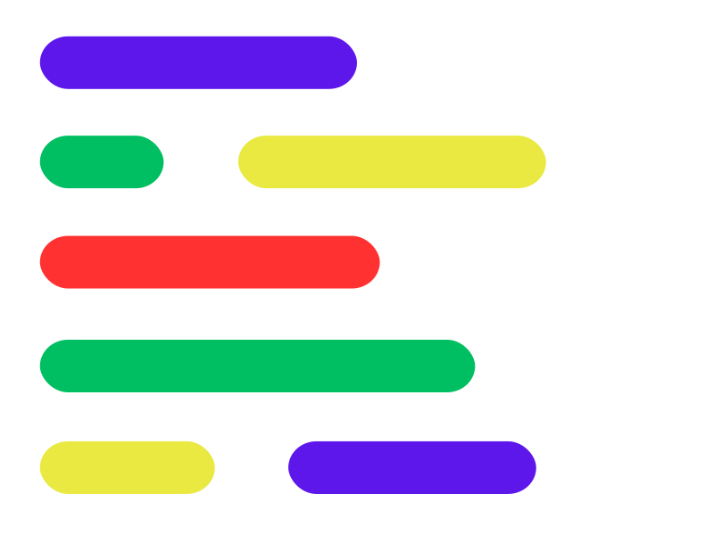

<p align="center">
  <a href="https://codespaces.online">
    
  </a>
</p>

<h1 align="center">
  CODESPACES.ONLINE
</h1>
<p align="center" fontSize="20px">
  Online Code editor and compiler
</p>

<p align="center">Dark Mode</p>


<p align="center">Light Mode</p>


<p align="center">Settings</p>


<p align="center">File system</p>


<p align="center">Input, Expected output and Output</p>


<p align="center">Languages</p>


## 🧐 Features

- **Syntax Highlighting**

- **Multiple language support**

- **Data saved on your localStorage**

- **Input and Expected output for faster check**

- **Code Formatting**

- **Light/Dark mode**

- **Multiple Theme support for editor**

- **Settings**

- **Multiple Code/Files support**
  
- **Autocomplete code**

- **Boilerplate**

- **Copy code, Download code and Fullscreen**

## 📝 Languages Supported

* `C++`
* `Java `
* `Python`
* `C`
* `C#`
* `Go`
* `JavaScript`
* `Ruby`
* `Kotlin`


## 🛠️ How to run locally

1. Clone the repository

```bash
git clone https://github.com/shrikantNemiwal1/code-editor
```

2. Change the working directory

```bash
cd code-editor
```

3. Install dependencies

```bash
npm install
```

4. Run the app

```bash
npm run dev
```
